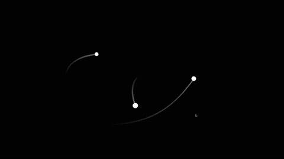

`## 3-Body Problem ##`

[](demos/vid.mp4)

This one simulates the socalled three body problem,
which describes the unpredictability (due to chaos) of
newtons laws being applied to three bodies, which are strongly
sensitive to the initial starting conditions. The only
external library it uses is pygame, all others are built into
python itself.

----

`## Running ##`

1. Make sure you have a new-ish version of pygame installed.
`$ pip install pygame`

2. Run the program. This will open up a new pygame window
simulating newtons laws on three bodies. The initial conditions
are defined in the reset function in main.py.
`$ python main.py`

3. Try different starting conditions. You can find them in the
reset function in main.py.
```py
def reset():
    global objects
    objects = []
    # try changing some of these numbers
    #                     mass,position,velocity
    objects.append(Object(60, (-25, 0), (0, -1)))
    objects.append(Object(100, (20, 0), (0, 0)))
    objects.append(Object(80, (0, 30), (3, 0)))
```

4. Hack it. The project is licensed under the MIT License and you
can find a copy in the LICENSE file.

5. Contribute. Have made great new changes? Feel free to PR.

----

&copy; 2024 Lucas Birkert - All Rights Reserved

